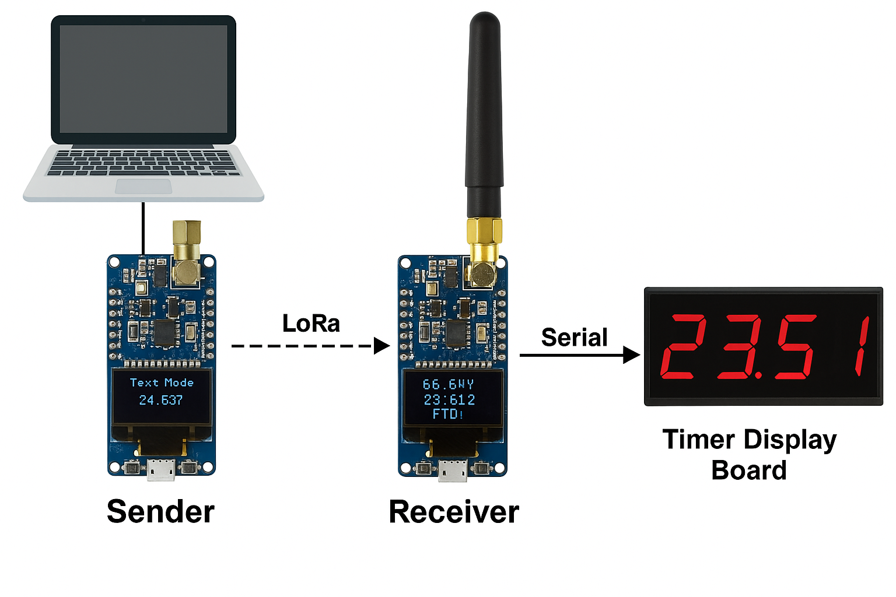

# SuperLiveTimer

This project contains Arduino sketches for a **LoRa-based wireless timing display system** using the [Heltec V3](https://heltec.org/project/wifi-lora-32-v3/) (ESP32 with LoRa and OLED display).

The system is designed for **motorsports or time trial events** where finish times and results need to be transmitted wirelessly from a sender to one or more receivers, and displayed on an OLED screen in real-time.

## Sketches Overview

- **receiver.ino**: Listens for incoming LoRa packets and outputs plain CSV to Serial.  Made for sending data to external displays.
- **handheld-receiver.ino**: Made for incar or handheld timing displays based on the Heltec V3. Has a WiFi hotspot mode for configuration changes.
- **sender.ino**: Supports both live Serial input mode **and** a Test Data mode (switchable by button press).

---

## Hardware Requirements

- [Heltec WiFi LoRa 32 (V3)](https://heltec.org/project/wifi-lora-32-v3/) boards (at least 2).
- USB cable for programming.
- Arduino IDE with Heltec board support and libraries.

---

## Library Dependencies

Install via **Library Manager**:
- `LoRaWan_APP.h` (from Heltec ESP32 board package)
- `HT_SSD1306Wire.h` (included with Heltec board package)

---

## Data Format

Communication uses a **CSV string**:
```
heat,finishTime,personalBest,ftd,offCourse,dnf,rerun,cones,carID
personalBest, ftd, offCourse, dnf and rerun are bools and are expecting a 0 or 1
```

**Example:**  
`1,34.334,0,0,0,0,0,0,66EVX`

---

## How to Use

### 1. receiver.ino

- **Outputs** received/parsed CSV data to Serial (115200 baud) for connection to timer displays, PCs, or Raspberry Pi.
- **MAGIC_WORD** filtering ensures only packets sent by a matching sender are displayed.
- **Setup:**
  1. Flash `receiver.ino` to a Heltec V3 board.
  2. Connect USB to PC/display hardware if using serial output.
  3. Watch the OLED or external display for results.

### 2. handheld-receiver.ino

- **Displays** incoming results on OLED (Car ID, time, status).
- **MAGIC_WORD** filtering ensures only packets sent by a matching sender are displayed.
- **Setup:**
  1. Flash `handheld-receiver.ino` to a Heltec V3 board.
  2. Connect USB to PC/display hardware if using serial output.
  3. Watch the OLED or external display for results.

### 3. sender.ino

- **Dual-mode operation:**  
  - **Serial Mode:** Default. Any line sent over Serial is parsed and sent via LoRa.
  - **Test Data Mode:** Generates simulated race results automatically every 3 seconds.
- **Switching Modes:**  
  - **Hold USER button (GPIO 0) for 1 second** to toggle between Serial and Test Data mode. OLED shows the current mode.
- **MAGIC_WORD** is included in each packet for filtering.
- **Setup:**
  1. Flash `sender.ino` to a Heltec V3.
  2. Connect USB for Serial input if desired.
  3. Use the USER button to switch modes as needed.

---

## Example Workflows

### Serial Input Mode
1. Open Serial Monitor (9600 baud).
2. Enter a line like:  
   ```
   1,34.334,0,0,0,0,0,0,66EVX
   ```
3. Sender transmits it, receiver displays and relays to external hardware via Serial.

### Test Data Mode
1. Hold USER button for 1 second to enter Test Mode.
2. The sender’s OLED shows "Test Mode" and sends random result data every 3 seconds for receiver testing.

---

## Configuration

- **LoRa Frequency:** Default 915MHz (North America). Change `RF_FREQUENCY` as needed.
- **MAGIC_WORD:** Change in both sketches for simple filtering if running multiple independent systems.

---

## System Diagram



---

## Troubleshooting

- Both sender and receiver must use the same frequency and MAGIC_WORD.
- Attach antennas before powering.
- Use Test Mode to verify the receiver system before connecting to real timing sources.

---